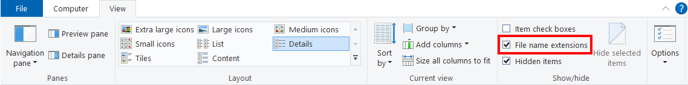
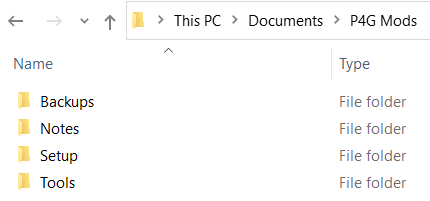
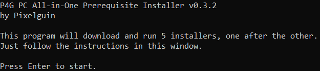

# Getting Started
## Requirements
- A registered installation of 64-bit Windows 8.1 or Windows 10
- An unmodified installation of **[Persona 4 Golden](https://steamcommunity.com/app/1113000/ "Persona 4 Golden")** from Steam
- An Internet connection during setup
- At least 3 GB of free space on your hard drive

**P4G CEP Team will not provide support for illegitimate software or for any other operating systems.**

## Show File Extensions
By default, Windows Explorer hides the extensions (.EXE, .PNG, etc.) of many file types. It's important that these be visible when setting up mods or asking for support, so we will make sure Windows always shows file extensions for all file types.

- Open **Windows Explorer** (the Windows file manager that you use to view Computer, Documents, etc.).
- Click the **View** tab at the top of the window.
- Check the box labelled **File name extensions** if it is not checked already.

## Delete Old P4G CEP Installation
> If this is your first time installing P4G CEP, skip this step.

We will be starting from scratch with this version of P4G CEP.

 - ***Delete*** your old `Reloaded-II` folder.
 - ***Delete*** your old `Aemulus Package Manager` folder.
 - ***Delete*** your old `Persona 4 Golden\mods` folder.

## Download P4G CEP 5.0

Download the latest version of P4G CEP now if you haven't already.

- [Download from **GameBanana**](https://gamebanana.com/gamefiles/12882)
- [Download from **Nexus Mods**](https://www.nexusmods.com/persona4golden/mods/11?tab=files)

## Set Up P4G Mods Folder
We will use a single dedicated folder named `P4G Mods` for everything related to P4G modding. It will contain all of the tools used to mod the game, as well as all of your mods. If you ever need to create a file backup or write down a note, save it in this folder to stay organized.

- Unzip your P4G CEP download and locate the `P4G Mods` folder.
- Move the `P4G Mods` folder to your account's `Documents` folder.

> Make sure you're using your user account's `Documents` folder and not your `OneDrive\Documents` folder.

## Install Prerequisites
> If you've used P4G CEP **3.4** or newer before, you already have these installed and can skip this step.

There are five .NET and Visual C++ packages that our modding tools need to run.

### Automatic Download and Installation
Pixelguin has created an  [open-source](https://github.com/Pixelguin/P4GPC.AIOPrerequisiteInstaller) program that will automatically download the prerequisites for you and run the installers one at a time.

1. Open your `P4G Mods\Setup` folder.
2. Run **Install_Prerequisites.exe**.
3. Follow the instructions in the console window to install each of the prerequisites you are missing.

### Manual Download and Installation

Alternatively, you can manually download and install the prerequisites yourself:

Prerequisite File | Download Link
------------ | -------------
Visual C++ 2015-2019 Redistributable (x64) | [Download](https://aka.ms/vs/16/release/VC_redist.x64.exe)
Visual C++ 2015-2019 Redistributable (x86) | [Download](https://aka.ms/vs/16/release/VC_redist.x86.exe)
.NET Core 3.1 Runtime (x64) | [Download](https://download.visualstudio.microsoft.com/download/pr/9845b4b0-fb52-48b6-83cf-4c431558c29b/41025de7a76639eeff102410e7015214/dotnet-runtime-3.1.10-win-x64.exe)
Windows Desktop (.NET 5) Runtime (x64) | [Download](https://download.visualstudio.microsoft.com/download/pr/c6a74d6b-576c-4ab0-bf55-d46d45610730/f70d2252c9f452c2eb679b8041846466/windowsdesktop-runtime-5.0.1-win-x64.exe)
Windows Desktop (.NET 5) Runtime (x86) | [Download](https://download.visualstudio.microsoft.com/download/pr/55bb1094-db40-411d-8a37-21186e9495ef/1a045e29541b7516527728b973f0fdef/windowsdesktop-runtime-5.0.1-win-x86.exe)

## Continue
### Next: [Steam Setup](03_steam_setup.md)
### [Extras](extras.md) // [**Troubleshooting**](troubleshooting.md)
