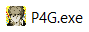

# Steam Setup
## Open Steam Properties
- Open Steam and go to your **Library**.
- Select **Persona 4 Golden** in your list of games.
- Right-click it and select **Properties**.

### Disable Automatic Updates
We don't expect P4G to ever get another update, but if it does, your mods will probably stop working until their mod creators can update them. To avoid any nasty surprises, we're going to disable automatic updates for P4G.

- In the *Properties* window, select **Updates**.
- Set *Automatic Updates* to **Only update this game when I launch it**.

### Set Text Language to English
> This only applies to the language of the game's text, not the character voices. English and Japanese voices both work with P4G CEP.

P4G CEP is only compatible with the English-text version of Persona 4 Golden. If you are using the Korean, Traditional Chinese, or Japanese-text version, you will need to change the game's Language setting in Steam.

- In the *Properties* window, select **Language**.
- Set *Select the language you wish to play this game in* to **English.**

### Enable Steam Input
Some newer game controllers (Xbox Series X, PS5) don't seem to work with P4G by default. We're going to enable **Steam Input** to force the game to recognize all controller types.

- In the *Properties* window, select **Controller**.
- Set *Override for Persona 4 Golden* to **Enable Steam Input**.

## Clean Game Files
P4G CEP is only compatible with the latest unmodified version of the game. To save a lot of time later, let's take a little time now to make sure you have the latest version of P4G and that it's not modified in any way.

### Opt Out of Betas
You may have joined an Atlus hotfix beta that was circulated before the release of P4G 1.1. These beta versions aren't compatible with P4G CEP, so let's make sure you aren't using one.

- In the Properties window, select **Betas**.
- Set **Select the beta you would like to opt into** to **None**.

### Verify Game Files
This will compare your local P4G files to the versions on Steam's servers and redownload any files that have been changed.

- In the Properties window, select **Local Files**.
- Click **Verify integrity of game files...** and wait for the validation process to complete. If Steam detects any file discrepancies, it will reacquire clean versions of those files.
- Click **OK** to close the *Validating Steam files* window. 

## Open Persona 4 Golden Folder

### Locate P4G.exe
*P4G.exe* is the name of the Persona 4 Golden executable program. It's important that you know where P4G.exe is located on your computer.

- Staying in the **Local Files** tab of the Properties window, click **Browse...** to open your `Persona 4 Golden` game folder in Windows Explorer.

> If you installed P4G within the first few hours of its release on 13 June 2020, the game folder may be named `Day` instead of `Persona 4 Golden`. You can fix this by completely uninstalling and reinstalling the game with Steam.

- Make sure there is an executable file named **P4G.exe** in this folder.

- Click the address bar at the top of the window to see the full folder path. You can copy and save this to a text file in `P4G Mods\Notes` if you think you might forget it.

### Disable Special K
> If you do not have Special K installed for P4G, skip this step.

The P4G mod loader and the *Special K* software are incompatible, and the game is likely to crash if you try to use them together. You'll need to remove Special K's injection file in order to play P4G with mods.

- Open your `Persona 4 Golden` folder and locate the file **dxgi.dll**.
- **Move** (not Copy) dxgi.dll to your `P4G Mods\Backups\Special K` folder.

- Launch P4G and make sure Special K is not running.
    - The Special K launch message should not appear anymore.
    - Trying to open the Special K configuration menu (*Ctrl + Shift + Backspace*) should do nothing now.

## Continue
### Next: [Reloaded-II Setup](04_reloaded_ii_setup.md)
### [Extras](extras.md) // [**Troubleshooting**](troubleshooting.md)
