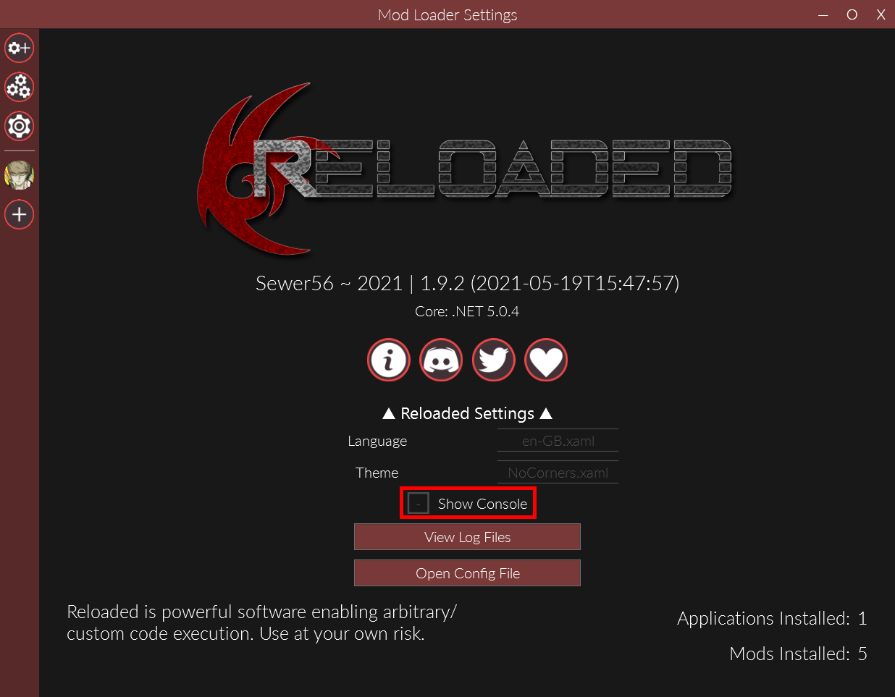

# Reloaded-II Setup
**Reloaded-II** is an [open-source](https://github.com/Reloaded-Project/Reloaded-II/) program that injects our mods into P4G with the **P4G PC Mod Loader** program.

> Reloaded-II calls the programs it manages "mods," but these are not the same as the P4G mods we are using (Texture Fixes Pack, etc.). We will set those up later with a different program.

## First Launch

- Open your `P4G Mods\Tools\Reloaded-II` folder.
- Launch **Reloaded-II.exe**.

### Disable Console
We're going to disable the console that Reloaded-II shows when running the game because it's distracting and can lower the framerate.

- After closing the first launch popup, disable **Show Console** by changing the red plus to a grey minus.

> Some mod creators may ask you to turn the console back on if they are helping you troubleshoot an issue.

## Configure P4G
### Open Application Settings
- Select the **Persona 4 Golden** icon on the left side of the window (the protagonist's ***dreamy*** face).

### Configure Opening Movie
> If you don't want to change the opening movie, skip this step.

- Select **Tiny Fixes** from the list of programs and click **Configure Mod**.

  - If you would like to skip the opening logos and movie entirely, check the **Intro Skip** box.
  - If you would like to replace P4G's "Shadow World" opening with the "Pursuing My True Self" opening from the original Persona 4, check the **P4 Title Movie** box.

- When you are done, select **Save** and close the *Configure Mod* window.

### Set P4G.exe Path
By default, Reloaded-II will search for *P4G.exe* at the most common location:

`C:\Program Files (x86)\Steam\steamapps\Persona 4 Golden\P4G.exe`

> If P4G **is** installed here, skip this step.

If you have P4G installed somewhere else, you'll need to tell Reloaded-II where to look.

- Under the **Main** section on the left side of the window, click **Edit Application**.

- Under the protagonist's BIG ***dreamy*** face, you will see three lines. Edit the *second* line to match your file path to *P4G.exe*. 

> Make sure **P4G.exe** is at the end of your file path, not just the `Persona 4 Golden` folder.

## Create Desktop Shortcut
Reloaded-II has to be called to inject mods into P4G. Just running the game through Steam will *not* inject any mods.

If you would like to create a desktop shortcut to launch P4G and inject mods, click **Create Shortcut** under the *Actions* section on the left side of the window.

> If you would like to create a Steam shortcut to launch the game and inject mods, refer to the **Extras** section of the instructions.

## Test Run
We're going to do a test launch of P4G through Reloaded-II to make sure everything works.

This will also create an empty  `Persona 4 Golden\mods` folder that we'll be working with in a moment.

- **Close all running framerate monitors (RTSS, MSI Afterburner) and "game boost" software (Razer Cortex) before continuing.**
- Under the *Main* section on the left side of the window, click **Launch Application** to launch P4G.
- Make sure the game loads and that you can press buttons/keys on the title screen.

**If everything works:**
You're ready to move on! Close P4G and go to the next step.

**If something doesn't work:** Double-check your P4G.exe path. Refer to the [**Troubleshooting**](troubleshooting.md) section for Reloaded-II before continuing.

## Continue
### Next: [Aemulus Setup](05_aemulus_setup.md)
### [Extras](extras.md) // [**Troubleshooting**](troubleshooting.md)
