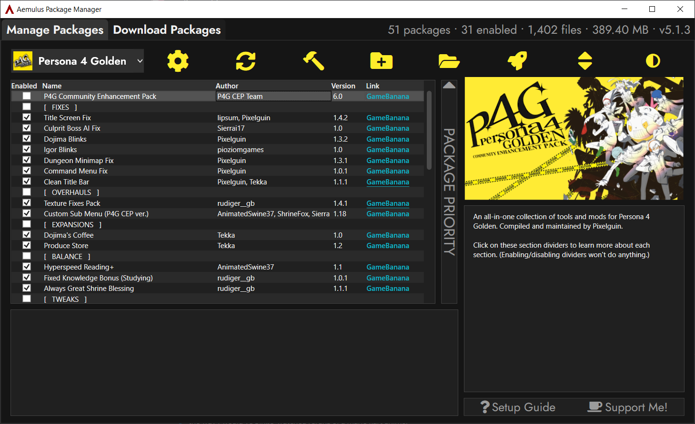
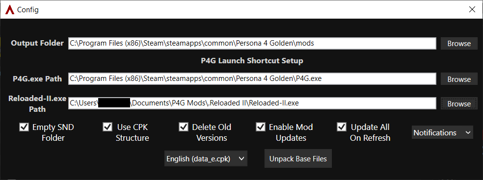
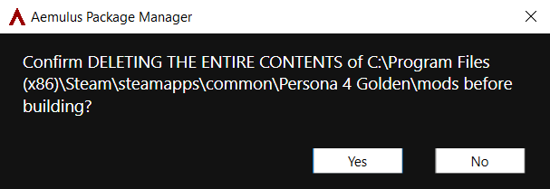

# Aemulus Setup
**Aemulus Package Manager** is an [open-source](https://github.com/TekkaGB/AemulusModManager) program that organizes, merges, and builds mod loadouts for Persona games.

> P4G CEP does not use the *Mod Compendium* program. Aemulus is capable of importing and converting Mod Compendium mods; see the [Extras](extras.md) section for more information.

## Information

The big list in the Aemulus window is called the **grid**.

Each individual entry on the grid is a **package**, a collection of loose files that Aemulus needs to **build** before it becomes a working mod in P4G.

When you tell Aemulus to build a mod loadout, it merges all the packages you have enabled into one set of files and saves them to your `Persona 4 Golden\mods` folder. The mod loader in Reloaded-II then uses that folder to swap in modded files when you launch the game.

## Configure Aemulus
Aemulus needs a bit of setup before we can dive into customization.

### First Launch
- Open your `P4G Mods\Tools\Aemulus Package Manager` folder.
- Launch **AemulusPackageManager.exe**.
- Make sure the box in the top left says *Persona 4 Golden*.
- Click the ⚙️ **Config** button to open the *Config* window.

### Set File Paths
Aemulus needs to know the location of your `Persona 4 Golden\mods` folder, *P4G.exe*, and *Reloaded-II.exe* in order to function.

 - Click **Browse** to the right of each box in the *Config* window and select the following files/folders:
    - *Output Folder:* `Persona 4 Golden\mods` folder
    - *P4G.exe Path:* `Persona 4 Golden\P4G.exe`
    - *Reloaded-II.exe Path:* `P4G Mods\Tools\Reloaded-II\Reloaded-II.exe`

### Double-Check Checkboxes
- Make sure the **Empty SND Folder** and **Use CPK Structure** boxes are both checked.

### Unpack Base Files
Aemulus needs to unpack the archives from P4G's data into a folder named `Original` so it can merge packages together.

- In the *Config* window, make sure the box in the bottom right says *English (data_e.cpk)*.
- Click **Unpack Base Files** and wait for the process to finish.
- Click **OK** to close the *Finished Unpacking!* window, then close the *Config* window.

## Customize Your Loadout
Now for the fun part! Choose which mods you'd like to use in P4G.

### Enabling/Disabling Packages

- Click on a package to get more information about it on the right side of the grid.
- To **enable** a package, check its box in the grid.
- To **disable** a package, uncheck its box in the grid.

> If you'd like to add your own mods that aren't part of P4G CEP, refer to the **Extras** section.

### Important Note
Make sure *only one* of each of these is enabled:
 - *Controller UI Overhaul*: Modern **or** Retro
 - *Useful Calendar*: Spoiler-Free **or** With Spoilers
 - *Portraits*: Combined Portraits Pack **or** P4 Arena Ultimax Portraits **or** P4 The Animation Portraits
 - *Font*: P5 Strikers Font **or** Slim Font

## Build Your Loadout
Aemulus needs to build your loadout in the `Persona 4 Golden\mods` folder once you've finished customizing it.

> Once you start building, Aemulus will delete ***everything*** in the output folder you defined in Config. Make sure you  don't have any important files there before continuing.

 - Click the 🔨 **Build** button once you're ready.
 - Aemulus will ask you to confirm that you want to delete the entire contents of the output folder. Make sure the folder in the confirmation box is your `Persona 4 Golden\mods` folder and click **Yes** to confirm.

 - Aemulus will begin merging packages and copying files. The process may take a few minutes.

## All finished! Let's play P4G!
Once Aemulus finishes building, you're ready to play!

- Click **OK** to close the *Finished Building!* window.
- Click 🚀 **Launch Persona 4 Golden** to call Reloaded-II and launch P4G.

> You can also use any of the Reloaded-II shortcuts you created earlier.

***Due to an increasing number of issues we are finding with the Prologue Skip mod, some of which result in softlocks, we are recommending all P4G CEP users not enable this feature.***

***We will try to fix this in an upcoming update or remove it if we cannot find fixes for the mod's issues.***

## One Last Tip

- Save the game often and on multiple save slots. I recommend every night or every other night at the Dojima residence.

## Continue
Head over to the [**Extras**](extras.md) section for instructions on:
- Adding custom packages to Aemulus
- Installing high quality Japanese voice lines
- Creating a shortcut to launch P4G with mods in your Steam library
- Removing the 60 FPS cap in Fullscreen mode

### [Extras](extras.md) // [**Troubleshooting**](troubleshooting.md)
