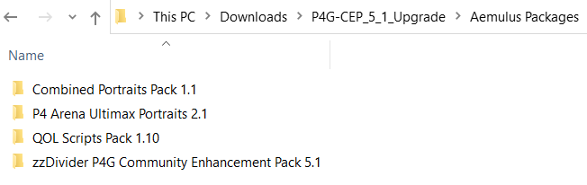
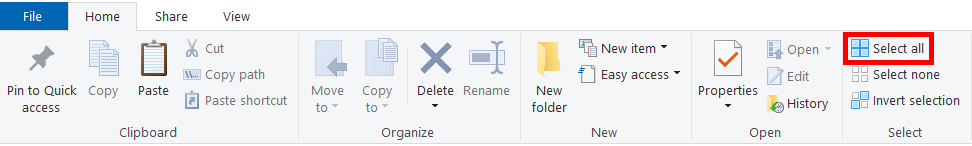

# Upgrade Instructions

## Download Version 5.1 Upgrade

Download the upgrade package for P4G CEP now if you haven't already.

* [Download from **GameBanana**](https://gamebanana.com/gamefiles/13256)
* [Download from **Nexus Mods**](https://www.nexusmods.com/persona4golden/mods/11?tab=files)

## Upgrade from Version 5.0

### Prepare for Upgrading Packages
* Open your `P4G Mods\Tools\Aemulus Package Manager` folder and launch **Aemulus**.
* Unzip your upgrade download and open the `Aemulus Packages` folder.

### Upgrade Packages

* Click the **Home** tab at the top of the `Aemulus Packages` folder window.
* Click the button labelled **Select all** to select all of the folders in the window.

* Drag all three folders at once onto the ➕ **Add Package** button in Aemulus, then release the mouse button to drop them.

> If you're having trouble dragging all of the folders at once, you can also drag and drop them one at a time.

* Aemulus will automatically refresh the window and upgrade your packages. All you need to do now is click **Build** again.

### Upgrade Backup File

* Open your `P4G Mods\Backups\Aemulus Package Manager` folder.
* In your upgrade folder, open the `Backups\Aemulus Package Manager` folder.
* Replace the **Persona4GoldenPackages.xml** file in your `P4G Mods\Backups\Aemulus Package Manager` folder with the one in your upgrade folder.
