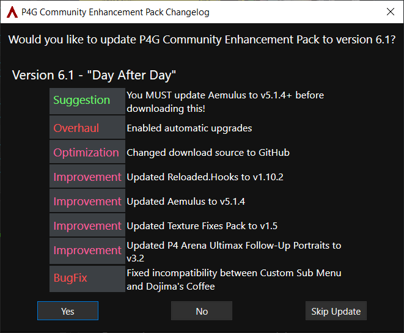
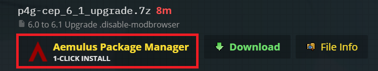
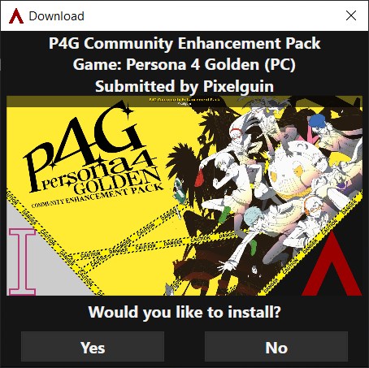

# Upgrade P4G CEP

### An Internet connection is required.

Please note that after upgrading, the package grid layout will be reset to default. 

Any custom packages you have installed will be disabled and moved to the bottom of the grid, but not deleted.

## Upgrading from v6.x

If you're upgrading from v6.0, you'll have the ability to get **automatic upgrades** in the future!

- If you have *Enable Mod Updates* and *Update All on Refresh* enabled in Aemulus, follow the **Automatic Upgrade** instructions.
- Otherwise, follow the **Manual Upgrade** Instructions.

### Automatic Upgrade

- Launch Aemulus. If you get a prompt to upgrade the program, click **Yes** and wait for Aemulus to update.
- After Aemulus restarts, it will automatically prompt you to download the latest version of P4G CEP. Select **Yes**.

> Make sure you are using **Aemulus 5.1.5+** before upgrading! Any older version will NOT install the upgrade properly!

- Aemulus will automatically download and upgrade P4G CEP for you. Future upgrades will be automatic as well!
- Make sure to customize and build your packages again after the installation finishes!

### Manual Upgrade

- Launch Aemulus. If you get a prompt to upgrade the program, click **Yes** and wait for Aemulus to update.
- Open the [GameBanana page](https://gamebanana.com/mods/50961) for P4G CEP.
- Scroll down to the *Files* section and click the **1-Click Install** option for the **6.x Upgrade**.

- Aemulus will launch and prompt you to download and install the upgrade. Select **Yes**.

- Aemulus will automatically download and upgrade P4G CEP for you.
- Make sure to customize and build your packages again after the installation finishes!

> It's recommended that you check the **Enable Mod Updates** and **Update All on Refresh** options in the Aemulus Config window, so you can upgrade P4G CEP from entirely within Aemulus in the future.

## Upgrading from Older Versions
P4G CEP requires a fresh start for all users upgrading from any version older than **6.0**.

Please follow the directions in [Getting Started](https://github.com/Pixelguin/P4G-CEP-docs/blob/master/docs/02_getting_started.md) (you can skim through the Steam setup since you've already done most of it).
